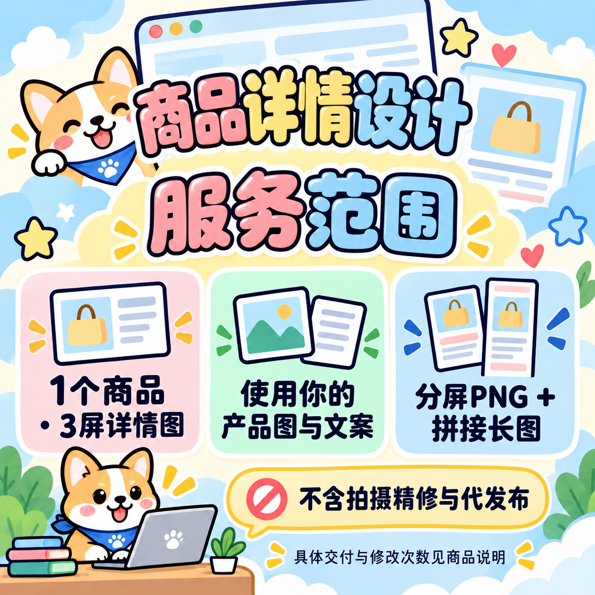

# 🐾 柯基商品图工作室

### 把认真做的服务，画成让人愿意停下来看的商品图。

**Corgi Commerce Images** 是一个可复用的 AI 图片创作技能：给出商品名、价格和服务范围，沿用同一套柯基卡通视觉，制作主图、范围说明和交付流程图。

奶油白与浅天蓝、圆润中文大字、蓝领巾柯基——让一组商品既有统一风格，也能清楚讲明白各自卖什么。

> 如果这只小柯基帮你省下了一次反复改提示词的时间，欢迎点一下 **Star ⭐**。也欢迎带着作品来交流：真实的使用反馈，会让这套模板更好用。

## 先看一套成品

| ① 商品主图 | ② 服务范围 | ③ 咨询交付 |
|---|---|---|
|  |  |  |

这些是实际生成的图片示例。图中价格、数量和服务内容仅用于展示版式，使用时应替换为自己的真实套餐。第三张示例含闲鱼平台文字，其他渠道需要替换后重新生成。

## 换商品，保留同一套视觉

| B2B官网详情设计 | 网站编辑器排版 | 产品参数表 |
|---|---|---|
|  |  |  |

## 适合用在哪里

- 商品与服务介绍：详情设计、网页制作、办公服务、课程指导等。
- 同系列宣传图：主图负责吸引注意，范围图解释套餐，流程图减少沟通成本。
- 需要中文大字、亲切角色、信息清楚的卡通宣传场景。

它尤其适合希望统一店铺视觉的个人创作者和小团队。偏写实摄影、严肃金融视觉或极简奢侈品海报，应另选合适的风格。

## 为什么把它整理出来

一张好看的图容易偶然出现，一组商品持续保持同样的视觉更难。这个仓库把可以复用的部分留下来：角色、配色、文字层级、三图分工，以及生成后该检查哪些地方。

你可以先用一张图试手，再把同样的方法用于自己的系列产品。示例和提示词直接放在仓库里，**不需要先 Star 才能使用，也没有“私信领取”步骤**。

## 快速安装

在支持技能安装的 Codex 环境里发送：

```text
请使用 $skill-installer 安装这个技能：
https://github.com/xiaodong-wu/corgi-commerce-images-skill/tree/main/skills/corgi-commerce-images
```

或者下载本仓库，将 `skills/corgi-commerce-images` 整个文件夹复制到当前环境的用户技能目录。当前官方文档列出的用户目录为 `~/.agents/skills`；安装器或旧版环境可能使用 `~/.codex/skills`，以安装器返回位置为准，避免在多个扫描目录重复安装同名技能。若列表尚未显示，可重启应用后查找。见 [OpenAI 技能文档](https://learn.chatgpt.com/docs/build-skills)。

本仓库是技能文件夹，不包含图片生成模型。实际出图需要所在环境提供图像生成工具；仅有文字能力的环境可以输出提示词，但不能因此声称已生成图片。

## 一句话调用

```text
使用 $corgi-commerce-images，给“商品详情设计定制”做3张同风格图片。
价格49元，包含1个商品的3屏详情图；客户提供产品图和文案。
交付PNG分屏图与拼接长图，不含拍摄精修和代发布。
用途是闲鱼商品草稿，图片保存到当前项目，不上架。
```

更轻量的单图：

```text
使用 $corgi-commerce-images 做一张“网站内容排版”主图。
卖点是标题层级、图文整理和粘贴说明。这次不展示价格。
```

批量创作：

```text
使用 $corgi-commerce-images，按我提供的产品表逐款制作三图。
统一角色和底色，各款使用不同的相关场景。价格只使用表格里的值。
缺少服务范围的产品先做无数量承诺的主图，并标出待补信息。
```

## 风格包含什么

| 视觉部分 | 具体做法 |
|---|---|
| 角色 | 棕白柯基、蓝领巾、粉色脸颊，配合商品场景 |
| 颜色 | 奶油白、浅天蓝，搭配粉、黄、薄荷绿 |
| 字体观感 | 大字、圆润、粗描边、白色贴纸边与柔和高光 |
| 信息结构 | 短标题 → 明确标签 → 场景图 → 简短行动提示 |
| 成套规则 | 主图介绍商品，第二张讲范围，第三张讲交付 |

详细规则见 [风格指南](skills/corgi-commerce-images/references/style-guide.md)，可复制模板见 [提示词模板](skills/corgi-commerce-images/references/prompt-templates.md)。

## 你会拿到什么

技能默认输出最终图片、实际使用的提示词和文件位置。批量创作会给出产品与文件的对应关系。用户指定只做一张时，技能不会强行生成整套。

生成模型存在随机性，不能保证每次像素级一致；中文、小数点和数量仍需逐张核对。技能包含定点修图方法，用来修正具体问题。它不保证点击率、成交量或平台审核结果，也不会自动上架、改价或操作店铺。

## 仓库结构

```text
skills/corgi-commerce-images/
├── SKILL.md                    技能入口
├── agents/openai.yaml          技能列表展示信息
├── references/style-guide.md   风格、版式与检查方法
├── references/prompt-templates.md
└── assets/                     三张风格参考图
examples/                       其他产品示例
ASSETS.md                       图片来源与使用说明
```

## 一起把它变得更好

欢迎提交 Issue 或 PR：带上你想做的产品类型、使用的提示词、实际结果与具体问题。分享图片前请去掉客户隐私和未授权素材。

尤其欢迎：更短但更清楚的中文标签、更多真实业务场景、不同尺寸的排版经验、错字或价格显示问题的复现。好的改进可以很小，一句更清楚的说明也有价值。

**喜欢这套风格，就把 Star 当作给小柯基的一块饼干吧 🦴。** 你的认可和反馈，都是这个小项目继续打磨的动力。

## 许可与说明

技能文本、模板与仓库中可授权的示例内容采用 [MIT License](LICENSE)。图片为 AI 生成，来源说明见 [ASSETS.md](ASSETS.md)。使用自己的商品事实和授权素材；本项目与 OpenAI、GitHub、闲鱼不存在官方背书关系。

---

**English:** A reusable Agent Skill for consistent, pastel corgi-themed Chinese commerce illustrations. Includes three-image layouts, prompt templates, visual references, and copy checks. Requires an image-generation-capable host. Examples are illustrative, not performance guarantees.
